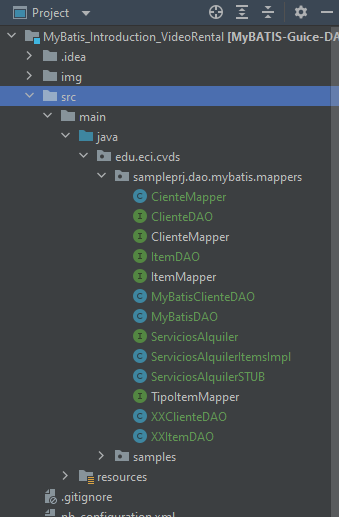
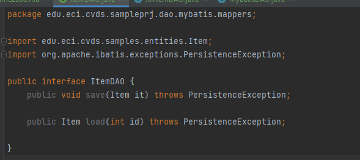

# Lab-08

## PARTE I. INICIO EN CLASE

**1.** Actualice el proyecto del taller realizados en el ejercicio anterior. Agregue las clases y excepciones no descritas de ser necesario.

**2.** Cree la interface ItemDAO y utilicela como referencia para realizar los Objetos de Acceso a los Datos (DAO) para las demas entidades:

**3.** Usando como referencia la implementación de ItemDAO: MyBATISItemDao, cree el DAO MyBATIS de las demas entidades:
